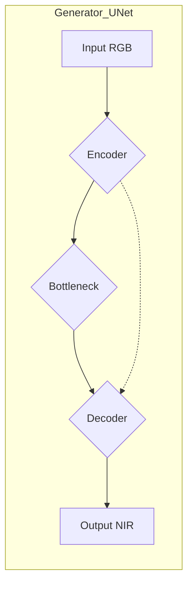
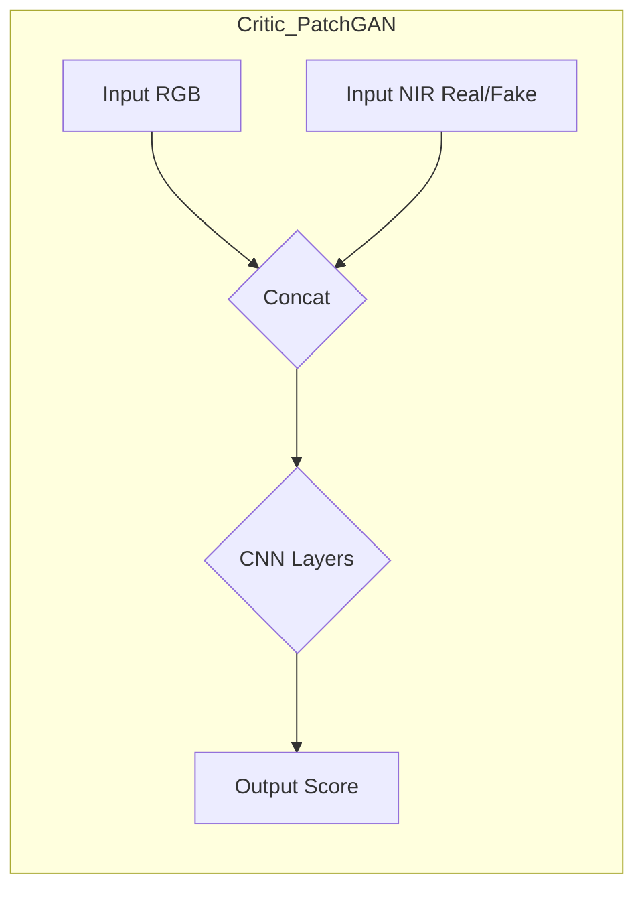
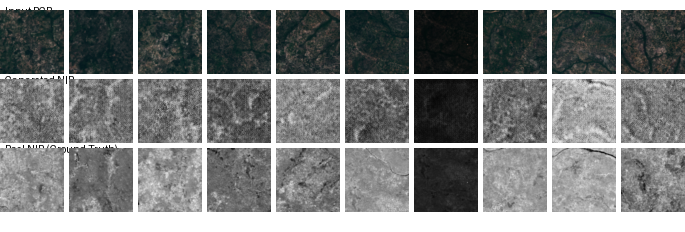

# Generating NIR Images from RGB using Conditional WGAN-GP

This project focuses on the task of generating Near-Infrared (NIR) images based on corresponding visible spectrum (RGB) images. A Conditional Wasserstein Generative Adversarial Network with Gradient Penalty (Conditional WGAN-GP) is used to solve this task.

## Problem Description and Task

Satellite and aerial images often contain information across various spectral bands. The NIR (Near-Infrared) channel is particularly important for analyzing vegetation, water bodies, and other aspects of the Earth's surface, as it provides information invisible in the standard RGB spectrum. However, not all sensors or datasets include an NIR channel, or it might be corrupted.

**The project task** is to develop and train a deep learning model capable of synthesizing a realistic NIR channel based on an existing RGB image. This will enhance data analysis capabilities where the NIR channel is missing or unavailable.

## Model Architecture

The model is based on the Conditional WGAN-GP architecture. It consists of two main components: a Generator and a Critic (Discriminator).

### Generator

The Generator is built upon the U-Net architecture. It takes an RGB image (3 channels) as input and generates the corresponding NIR image (1 channel). U-Net is well-suited for image-to-image translation tasks due to its skip connections (shown with dashed lines), which allow low-level features from the encoder to be passed directly to the decoder, improving the detail in generated images.



### Critic / Discriminator

The Critic is a convolutional neural network (PatchGAN-like architecture). It takes a pair of images as input: the RGB image (condition) and an NIR image (either real from the dataset or generated by the Generator). The Critic's task is to evaluate how "realistic" the provided NIR component is in the context of the given RGB image. The WGAN-GP Critic does not use a sigmoid activation in the output layer and is trained to output higher values for real pairs and lower values for generated ones.



### WGAN-GP Loss Function
*   **Critic Loss:** Aims to maximize the difference between the scores for real and fake pairs, with an added gradient penalty to enforce 1-Lipschitz continuity.
    `Loss_D = E[Critic(RGB, Fake_NIR)] - E[Critic(RGB, Real_NIR)] + λ * GradientPenalty`
*   **Generator Loss:** Aims to maximize the Critic's score for generated images.
    `Loss_G = -E[Critic(RGB, Fake_NIR)]`

## Project Structure


```
├── RGB_to_NIR/ # Main project folder
│ ├── main.py # Original training script (full-size models)
│ ├── main_small.py # Training script with reduced models and image size (current)
│ └── data-analiz.ipynb # Jupyter Notebook for experiments/analysis (if any)
├── models/ # Folder for saving trained models (checkpoints)
│ └── rgb_to_nir_wgan_gp_small_v1/ # Example subfolder for a specific experiment
│ ├── generator_epoch_X.pth
│ └── critic_epoch_X.pth
├── runs/ # Folder for TensorBoard logs
│ └── rgb_to_nir_wgan_gp_small_v1/ # Example subfolder for a specific experiment
│ └── (TensorBoard event files)
├── README.md # This file
└── .gitignore # File to exclude unnecessary files from Git

```


*   **`RGB_to_NIR/`**: Contains the project's source code, including training scripts and potentially notebooks for data analysis or experiments.
*   **`models/`**: This directory will store the weights of the trained models (generator and critic) at various training stages (checkpoints). It's recommended to create subdirectories for each experiment or model version.
*   **`runs/`**: TensorBoard will write training logs here (loss values, metrics, examples of generated images). Using subdirectories for different runs is also recommended.

## Dataset

The SEN12MS dataset was used for training the model. This dataset contains multispectral images from Sentinel-1 (SAR) and Sentinel-2 (optical, including RGB and NIR channels), along with other auxiliary data.

*   **Dataset Link (Original Publication):** [SEN12MS: A Curated Dataset of Paired SAR and Multi-Spectral Satellite Imagery for Deep Learning and Data Fusion](https://mediatum.ub.tum.de/1474000)
*   **Kaggle Description (if you used it from there):** [SEN12MS - A Multi-Sensor Land Cover Classification Dataset](https://www.kaggle.com/datasets/nikitarom/sen12ms-a-multi-sensor-land-cover-classification)
    (You specified the path `/Users/mantesssa/Downloads/archive/sen12ms_All_seasons`, which resembles the structure from Kaggle or a similar archive).

This project uses pairs of RGB (from Sentinel-2) and NIR (also from Sentinel-2) images. It assumes the data is organized into folders like `train_A` (RGB), `train_B` (NIR), `val_A`, `val_B`, etc.

## How to Run

1.  **Clone the repository:**
    ```bash
    git clone <your_repository_URL>
    cd <repository_name>
    ```
2.  **Install dependencies:**
    ```bash
    pip install torch torchvision torchaudio tqdm Pillow numpy tensorboard
    ```
    (Ensure you have a PyTorch version compatible with your hardware, e.g., with MPS support for Apple Silicon).
3.  **Prepare the dataset:**
    *   Download the SEN12MS dataset (or the part containing Sentinel-2 RGB and NIR channels).
    *   Organize the data according to the structure expected by the `RGBNIRPairedDataset` class (e.g., `path_to_dataset/train_A/`, `path_to_dataset/train_B/`).
    *   Update the `root_dir` parameter in the configuration dictionary within the `main_small.py` (or `main.py`) script.
4.  **Configure settings:**
    Open `main_small.py` (or `main.py`) and modify parameters in the `config` dictionary if needed (e.g., `batch_size`, `num_epochs`, `image_size`, model parameters, paths for logs and checkpoints).
5.  **Start training:**
    ```bash
    python RGB_to_NIR/main_small.py
    ```
6.  **Monitor progress with TensorBoard:**
    In a new terminal window, navigate to the project's root folder and run:
    ```bash
    tensorboard --logdir=runs
    ```
    Open the provided URL (usually `http://localhost:6006/`) in your browser.

## Preliminary Results

Below are some early visual results from the Conditional WGAN-GP model. These results are preliminary, and the model requires further training to improve the quality and accuracy of the generated Near-Infrared (NIR) images.

The image shows:
*   **Top Row:** Input RGB images.
*   **Middle Row:** Real NIR images (Ground Truth).
*   **Bottom Row:** NIR images generated by the WGAN-GP model from the corresponding input RGB images.



## Future Improvements (Possible)

*   Implement a validation loop and log image quality metrics (PSNR, SSIM) on the validation set.
*   More sophisticated data augmentation (if required).
*   Comparison with other architectures (e.g., Pix2PixHD, Diffusion Models).
*   Hyperparameter optimization.
