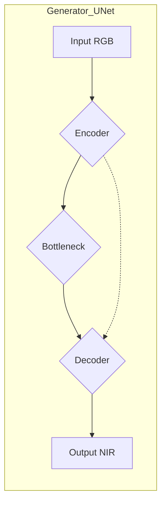
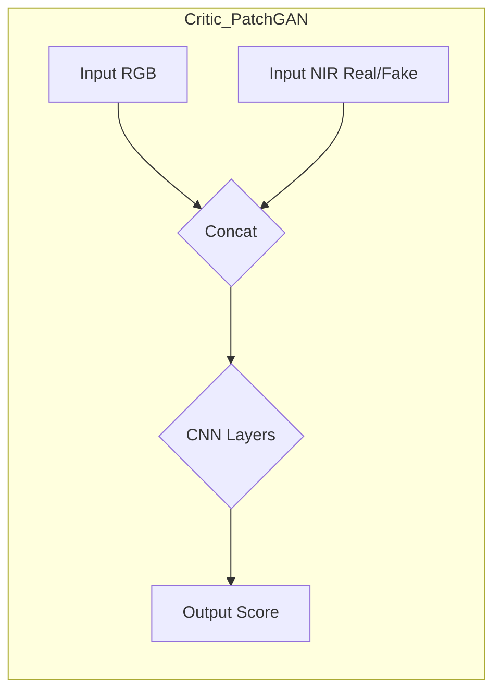

# Генерация NIR-изображений из RGB с использованием Conditional WGAN-GP

Этот проект посвящен задаче генерации изображений в ближнем инфракрасном (NIR) диапазоне на основе соответствующих изображений в видимом (RGB) диапазоне. Для решения этой задачи используется Условная Wasserstein Generative Adversarial Network с градиентным штрафом (Conditional WGAN-GP).

## Описание Проблемы и Задачи

Спутниковые и аэрофотоснимки часто содержат информацию в различных спектральных диапазонах. Канал NIR (Near-Infrared) особенно важен для анализа растительности, водных объектов и других аспектов земной поверхности, так как он предоставляет информацию, невидимую в обычном RGB-спектре. Однако, не все сенсоры или наборы данных содержат NIR-канал, или же он может быть поврежден.

**Задача проекта** — разработать и обучить модель глубокого обучения, способную синтезировать реалистичный NIR-канал на основе имеющегося RGB-изображения. Это позволит расширить возможности анализа данных там, где NIR-канал отсутствует или недоступен.


## Архитектура Модели

Модель основана на архитектуре Conditional WGAN-GP. Она состоит из двух основных компонентов: Генератора и Критика (Дискриминатора).

### Генератор (Generator)

Генератор построен на основе архитектуры U-Net. Он принимает на вход RGB-изображение (3 канала) и генерирует соответствующее NIR-изображение (1 канал). U-Net хорошо подходит для задач image-to-image трансляции благодаря наличию skip-соединений (показаны пунктирной линией), которые позволяют передавать низкоуровневые признаки из энкодера напрямую в декодер, улучшая детализацию генерируемых изображений.




### Критик / Дискриминатор (Critic / Discriminator)

Критик представляет собой сверточную нейронную сеть (PatchGAN-подобная архитектура). Он принимает на вход пару изображений: RGB-изображение (условие) и NIR-изображение (либо реальное из датасета, либо сгенерированное Генератором). Задача Критика — оценить, насколько "реалистичной" является представленная NIR-компонента в контексте данного RGB-изображения. Критик WGAN-GP не использует сигмоиду на выходе и обусловливается выдавать более высокие значения для реальных пар и более низкие для сгенерированных.



### Функция Потерь WGAN-GP
*   **Потери Критика:** Направлены на максимизацию разницы между оценками для реальных и фейковых пар, с добавлением градиентного штрафа для обеспечения 1-Липшицевости.
    `Loss_D = E[Critic(RGB, Fake_NIR)] - E[Critic(RGB, Real_NIR)] + λ * GradientPenalty`
*   **Потери Генератора:** Направлены на максимизацию оценки Критика для сгенерированных изображений.
    `Loss_G = -E[Critic(RGB, Fake_NIR)]`

```
├── RGB_to_NIR/ # Основная папка проекта
│ ├── main.py # Оригинальный скрипт обучения (полноразмерные модели)
│ ├── main_small.py # Скрипт обучения с уменьшенными моделями и размером изображений (текущий)
│ └── data-analiz.ipynb # Jupyter Notebook с экспериментами/анализом (если есть)
├── models/ # Папка для сохранения обученных моделей (чекпоинтов)
│ └── rgb_to_nir_wgan_gp_small_v1/ # Пример подпапки для конкретного эксперимента
│ ├── generator_epoch_X.pth
│ └── critic_epoch_X.pth
├── runs/ # Папка для логов TensorBoard
│ └── rgb_to_nir_wgan_gp_small_v1/ # Пример подпапки для конкретного эксперимента
│ └── (файлы событий TensorBoard)
├── README.md # Этот файл
└── .gitignore # Файл для исключения ненужных файлов из Git

```


*   `RGB_to_NIR/`: Содержит исходный код проекта, включая скрипты для обучения и, возможно, ноутбуки для анализа данных или экспериментов.
*   `models/`: В этой директории будут сохраняться веса обученных моделей (генератора и критика) на различных этапах обучения (чекпоинты). Рекомендуется создавать подпапки для каждого эксперимента или версии модели.
*   `runs/`: Сюда TensorBoard будет записывать логи обучения (значения функций потерь, метрики, примеры сгенерированных изображений). Также рекомендуется использовать подпапки для разных запусков.

## Датасет

Для обучения модели использовался датасет SEN12MS. Этот датасет содержит мультиспектральные снимки Sentinel-1 (SAR) и Sentinel-2 (оптические, включая RGB и NIR каналы), а также другие вспомогательные данные.

*   **Ссылка на датасет (исходная публикация):** [SEN12MS: A Curated Dataset of Paired SAR and Multi-Spectral Satellite Imagery for Deep Learning and Data Fusion](https://mediatum.ub.tum.de/1474000)
*   **Описание на Kaggle (если вы использовали его оттуда):** [SEN12MS - A Multi-Sensor Land Cover Classification Dataset](https://www.kaggle.com/datasets/nikitarom/sen12ms-a-multi-sensor-land-cover-classification)
    (Вы указали путь `/Users/mantesssa/Downloads/archive/sen12ms_All_seasons`, что похоже на структуру с Kaggle или аналогичного архива).

В данном проекте используются пары RGB (из Sentinel-2) и NIR (также из Sentinel-2) изображений. Предполагается, что данные организованы в папки `train_A` (RGB), `train_B` (NIR), `val_A`, `val_B` и т.д.

## Как Запустить

1.  **Клонировать репозиторий:**
    ```bash
    git clone <URL_вашего_репозитория>
    cd <имя_репозитория>
    ```
2.  **Установить зависимости:**
    ```bash
    pip install torch torchvision torchaudio tqdm Pillow numpy tensorboard
    ```
    (Убедитесь, что у вас установлена версия PyTorch, совместимая с вашим оборудованием, например, с поддержкой MPS для Apple Silicon).
3.  **Подготовить датасет:**
    *   Скачайте датасет SEN12MS (или его часть, содержащую RGB и NIR каналы Sentinel-2).
    *   Организуйте данные в соответствии со структурой, ожидаемой классом `RGBNIRPairedDataset` (например, `path_to_dataset/train_A/`, `path_to_dataset/train_B/`).
    *   Обновите параметр `root_dir` в конфигурационном словаре в скрипте `main_small.py` (или `main.py`).
4.  **Настроить конфигурацию:**
    Откройте `main_small.py` (или `main.py`) и при необходимости измените параметры в словаре `config` (например, `batch_size`, `num_epochs`, `image_size`, параметры моделей, пути для логов и чекпоинтов).
5.  **Запустить обучение:**
    ```bash
    python RGB_to_NIR/main_small.py
    ```
6.  **Отслеживать прогресс с помощью TensorBoard:**
    В новом окне терминала перейдите в корневую папку проекта и запустите:
    ```bash
    tensorboard --logdir=runs
    ```
    Откройте указанный URL (обычно `http://localhost:6006/`) в браузере.

## Будущие Улучшения (Возможные)

*   Реализация цикла валидации и логирование метрик качества изображений (PSNR, SSIM) на валидационном наборе.
*   Более сложная аугментация данных (если потребуется).
*   Сравнение с другими архитектурами (например, Pix2PixHD, Diffusion Models).
*   Оптимизация гиперпараметров.


